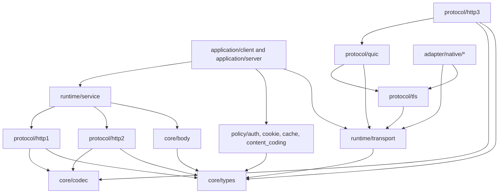

# MoonbitHTTP 0.7 architecture target

> Status: canonical
> Scope: package ownership, capability boundaries and state-machine rules for
> the 0.7.0 development line; “v1” names the target architecture, not a 1.0
> release.
> Source: working-tree (governed by Git)
> Last reviewed: 2026-10-01

This document is the implementation boundary for the v1 restructuring. It
describes ownership and data flow; it is not a production approval.

## Package ownership

The intended dependency graph uses `A --> B` to mean “A imports B”. Codec,
state, and driver responsibilities can be files within a protocol package;
they do not require wrapper packages or a trait for every implementation.

The [package map](packages.md) names the public, adapter and test layers. The
[generated dependency graph](../reference/generated/dependencies.md) records
actual imports, including separate test dependencies. `repo-tools/tools/check_architecture.mbtx` checks
ownership rules and graph drift in CI. HPACK and QPACK share the Huffman codec
in `core/codec`; HTTP/3 does not import HTTP/2.

- `core/types` owns public request, response, header, URI, authority, numeric IP,
  endpoint, limit, and
  protocol-independent error values.
- `core/body` owns body producers and consumers, bounded queues, backpressure,
  cancellation, and completion. Protocol packages decide framing and only
  emit body events.
- `core/codec` owns incremental byte buffering and primitive encoding helpers. It
  has no network or task lifecycle dependency.
- `protocol/http1`, `protocol/http2`, `protocol/quic`, and `protocol/http3` expose codec/state boundaries and
  a driver boundary. A state object owns protocol invariants; a driver owns
  I/O, deadlines, and task cleanup.
- `runtime/transport` owns capability traits for streams, datagrams, resolution,
  policy, clock, entropy, stream TLS and QUIC TLS. Native adapters implement those traits and do
  not add hidden DNS, policy, or TLS fallbacks.
- `protocol/tls` owns pure TLS handshake framing, QUIC key derivation and packet
  protection primitives. `adapter/native/tls` implements the transport contracts
  using OpenSSL; credentials, peer verification, ALPN and QUIC traffic
  secrets remain behind this adapter boundary.
- `runtime/service` owns connection scope and shutdown. `application/client` and `application/server` own
  request policy and orchestration, not protocol parsing.

## State-machine rules

Protocol drivers must validate transitions before mutating state. QUIC frame
legality is a function of packet number space and connection phase; HTTP/3
  request validation is a function of field section kind and the relevant
  endpoint's SETTINGS. The server authorizes incoming extended CONNECT using
  its own advertised setting; the client checks the server's setting before
  encoding an outgoing extended CONNECT.
Path migration is an action sequence: authorize, emit a challenge to the
candidate endpoint, authenticate a matching response, then switch the active
path. The response validates the path on which the challenge was sent; RFC
9000 permits receiving that response on another path.

## v1 public API policy

The 0.6 API is not the v1 compatibility target. During migration, new code
must use the canonical capability-injected constructors and state APIs. Any
temporary adapter must be isolated, documented, and removable before the
`1.0.0` release; it must not introduce a second implementation of protocol
rules.

Every network connection path must receive an explicit resolver (or an already
numeric endpoint), `NetworkPolicy`, clock, and TLS provider. A hostname must
never be resolved after authorization by a lower-level connector.

## Migration order

1. Freeze the baseline and generated interfaces.
2. Consolidate `types`, `body`, `codec`, and `transport` ownership.
3. Move protocol checks into codec/state boundaries, then keep drivers thin.
4. Route `service`, `client`, and `server` through one canonical constructor
   per capability set.
5. Complete QUIC/TLS 1.3, Native credentials, HTTP/3 interoperability, stress,
   performance, and independent security gates.
6. Remove migration adapters and regenerate interfaces and release evidence.

Each step must preserve the existing four-target behavior matrix until an
equivalent v1 test exists. A green unit-test matrix alone does not close an
interoperability or production-release gate.

## Design references

- [Go net/http](https://pkg.go.dev/net/http#RoundTripper): separate request
  policy from transport, and make response-body ownership explicit.
- [Hyper](https://docs.rs/hyper/latest/hyper/): keep protocol engines small,
  with streaming bodies and host-provided runtime capabilities.
- [quinn-proto](https://docs.rs/quinn-proto/latest/quinn_proto/): drive a
  deterministic protocol state machine with input events and output actions.
- [RFC 9000](https://www.rfc-editor.org/rfc/rfc9000.html): packet spaces,
  authenticated transport parameters, stream direction and path validation.
- [RFC 9220](https://www.rfc-editor.org/rfc/rfc9220.html): extended CONNECT
  uses a capability advertised by the server.

These are responsibility boundaries to adapt, not APIs to copy wholesale.
