# Generated local package dependencies

Generated from every repository `moon.pkg` by `repo-tools/tools/check_architecture.mbtx`.
Solid arrows are main imports; dotted arrows are test-only imports, labeled by target.
Architecture boundary checks apply to both. External dependencies are omitted.

```mermaid
flowchart TD
  p_core_body["core/body"]
  p_adapter_uv["adapter/uv"]
  p_core_codec["core/codec"]
  p_core_types["core/types"]
  p_policy_auth["policy/auth"]
  p_policy_cache["policy/cache"]
  p_protocol_tls["protocol/tls"]
  p_policy_cookie["policy/cookie"]
  p_protocol_quic["protocol/quic"]
  p_protocol_http1["protocol/http1"]
  p_protocol_http2["protocol/http2"]
  p_protocol_http3["protocol/http3"]
  p_runtime_service["runtime/service"]
  p_runtime_detection["runtime/detection"]
  p_runtime_transport["runtime/transport"]
  p_adapter_native_tls["adapter/native/tls"]
  p_application_client["application/client"]
  p_application_server["application/server"]
  p_adapter_native_client["adapter/native/client"]
  p_adapter_native_server["adapter/native/server"]
  p_internal_test_support["internal/test_support"]
  p_policy_content_coding["policy/content_coding"]
  p_adapter_native_transport["adapter/native/transport"]
  p_examples_cmd_smoke_server["examples/cmd/smoke_server"]
  p_examples_cmd_h3_smoke_server["examples/cmd/h3_smoke_server"]
  p_core_body --> p_core_types
  p_policy_auth --> p_core_types
  p_policy_cache --> p_core_types
  p_policy_cookie --> p_core_types
  p_protocol_quic --> p_core_types
  p_protocol_http1 --> p_core_codec
  p_protocol_http1 --> p_core_types
  p_protocol_http2 --> p_core_codec
  p_protocol_http2 --> p_core_types
  p_protocol_http3 --> p_core_codec
  p_protocol_http3 --> p_core_types
  p_runtime_service --> p_core_body
  p_protocol_quic --> p_protocol_tls
  p_runtime_service --> p_core_types
  p_application_client --> p_core_body
  p_protocol_http3 --> p_protocol_quic
  p_runtime_detection --> p_core_types
  p_runtime_transport --> p_core_types
  p_adapter_native_tls --> p_core_types
  p_application_client --> p_core_types
  p_application_client --> p_policy_auth
  p_protocol_tls --> p_runtime_transport
  p_runtime_service --> p_protocol_http1
  p_runtime_service --> p_protocol_http2
  p_application_client --> p_policy_cache
  p_policy_content_coding --> p_core_body
  p_protocol_quic --> p_runtime_transport
  p_adapter_native_client -. "test" .-> p_core_types
  p_adapter_native_server --> p_core_types
  p_application_client --> p_policy_cookie
  p_internal_test_support -. "test" .-> p_core_types
  p_policy_content_coding --> p_core_types
  p_adapter_native_tls -. "wbtest" .-> p_protocol_tls
  p_application_client --> p_protocol_http1
  p_runtime_service --> p_runtime_detection
  p_adapter_native_tls -. "wbtest" .-> p_protocol_quic
  p_application_client --> p_runtime_service
  p_adapter_native_transport --> p_core_types
  p_examples_cmd_smoke_server --> p_core_body
  p_protocol_quic -. "test" .-> p_internal_test_support
  p_adapter_native_tls --> p_runtime_transport
  p_application_client --> p_runtime_transport
  p_application_server --> p_runtime_transport
  p_examples_cmd_smoke_server --> p_core_types
  p_internal_test_support -. "test" .-> p_protocol_http1
  p_adapter_native_client --> p_runtime_transport
  p_adapter_native_server --> p_runtime_transport
  p_examples_cmd_h3_smoke_server --> p_core_types
  p_internal_test_support --> p_runtime_transport
  p_adapter_native_client -. "test" .-> p_adapter_native_tls
  p_adapter_native_client --> p_application_client
  p_adapter_native_server --> p_application_server
  p_application_client -. "test" .-> p_internal_test_support
  p_application_client --> p_policy_content_coding
  p_examples_cmd_smoke_server --> p_runtime_service
  p_adapter_native_client -. "wbtest" .-> p_adapter_native_tls
  p_adapter_native_server -. "wbtest" .-> p_adapter_native_tls
  p_adapter_native_server -. "wbtest" .-> p_application_server
  p_adapter_native_tls -. "wbtest" .-> p_internal_test_support
  p_adapter_native_transport --> p_runtime_transport
  p_examples_cmd_h3_smoke_server --> p_protocol_quic
  p_adapter_native_client --> p_policy_content_coding
  p_adapter_native_tls --> p_adapter_native_transport
  p_examples_cmd_h3_smoke_server --> p_protocol_http3
  p_adapter_native_transport -. "wbtest" .-> p_runtime_transport
  p_adapter_native_client --> p_adapter_native_transport
  p_examples_cmd_h3_smoke_server --> p_runtime_transport
  p_examples_cmd_h3_smoke_server --> p_adapter_native_tls
  p_adapter_native_server -. "wbtest" .-> p_adapter_native_transport
  p_examples_cmd_h3_smoke_server --> p_adapter_native_transport
```

